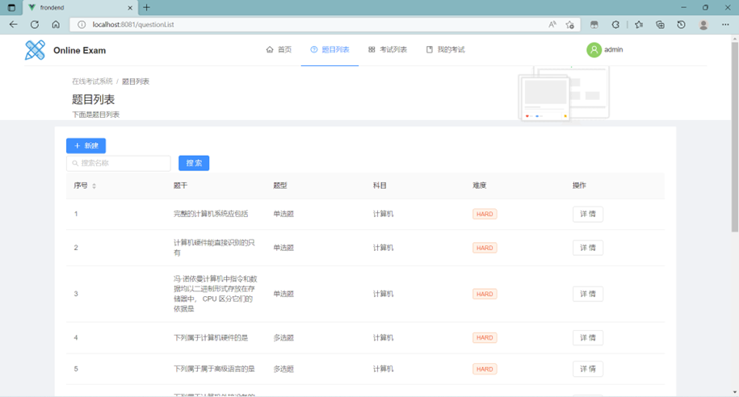

# web_exam_project
同济大学`Web技术`课程期末大作业。

### 开发人员
<a href="https://github.com/Raxio-Z">Raxio-Z</a>
&
<a href="https://github.com/codejoker-c">codejoker-c</a>
### 主要功能
在线考试系统Online Exam，主要使用Vue cli脚手架结合Ant Design Vue搭建前端，使用SpringBoot结合MyBatis搭建后端，并采用MySQL作为数据库，实现登录注册、查看问题、新建问题、查看考试、新建考试、参加考试、考试管理和个人设置等功能，能够基本满足线上测试的需求，并按照功能进行了页面的设计与优化，尽量体现简洁与美观的效果，以实现较好的交互效果。
### 架构

### 界面展示
* **登录注册界面**

* **首页**

* **题目列表**

* **考试列表**

* **考试答题页面**

* **我的考试**

### 参考
https://github.com/lsgwr/spring-boot-online-exam
